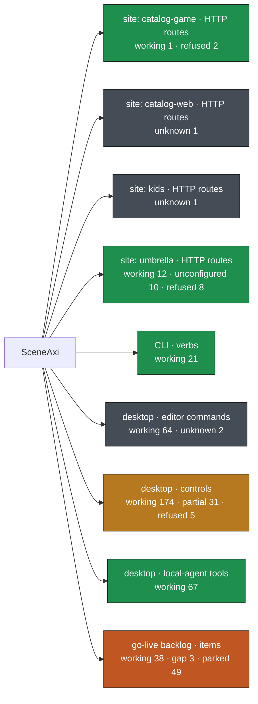

# SceneAxi surface map

Generated by `node scripts/surface-map.mjs` from probe `e61b51b` (2026-09-26T22:14:47.409Z).
no provider environment (every provider-backed plane is expected to report unconfigured). Each box is coloured by its worst open state; the per-node view is
[surface-map.html](surface-map.html), the data [surface-map.json](surface-map.json).

Totals: working 377 · partial 31 · unconfigured 10 · refused 15 · gap 3 · parked 49 · unknown 4

