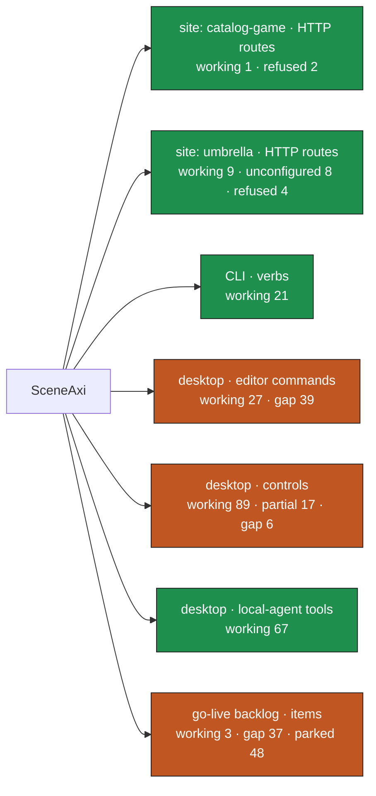

# SceneAxi surface map

Generated by `node scripts/surface-map.mjs` from probe `730e822` (2026-09-26T15:29:34.610Z).
no provider environment (every provider-backed plane is expected to report unconfigured). Each box is coloured by its worst open state; the per-node view is
[surface-map.html](surface-map.html), the data [surface-map.json](surface-map.json).

Totals: working 217 · partial 17 · unconfigured 8 · refused 6 · gap 82 · parked 48

